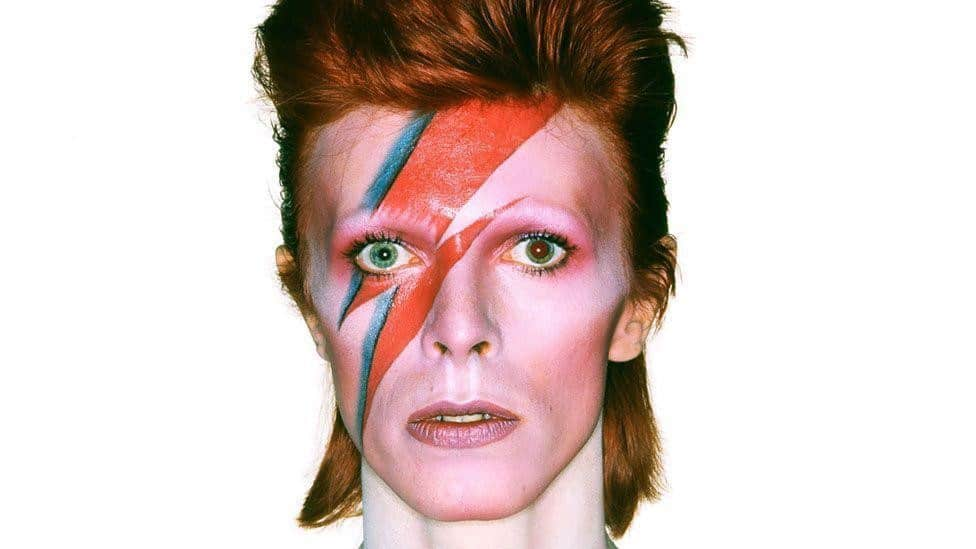
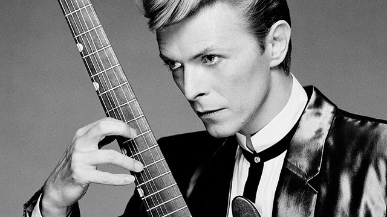
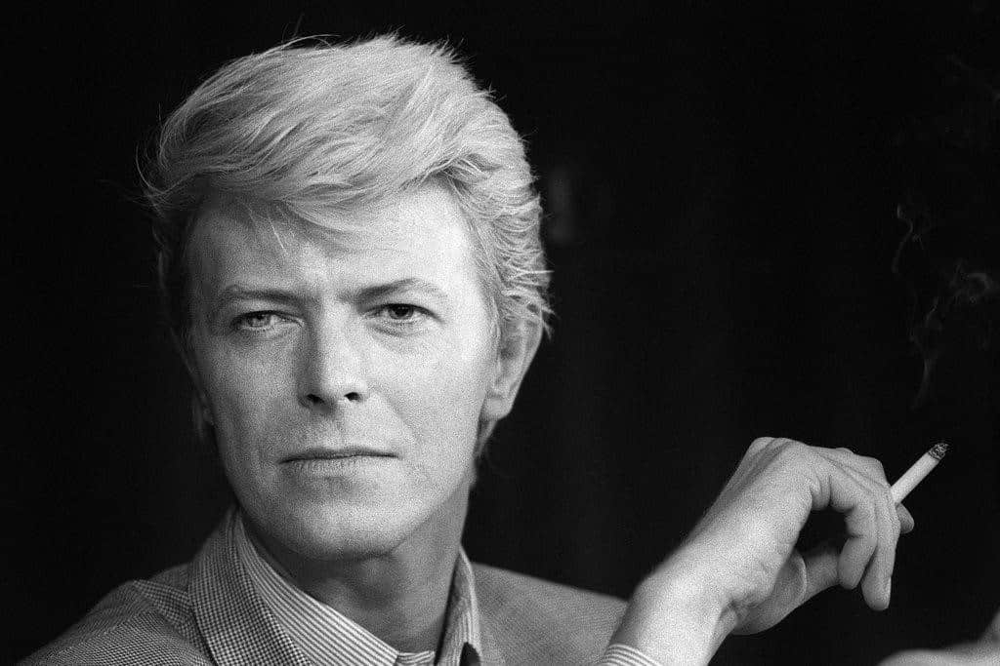
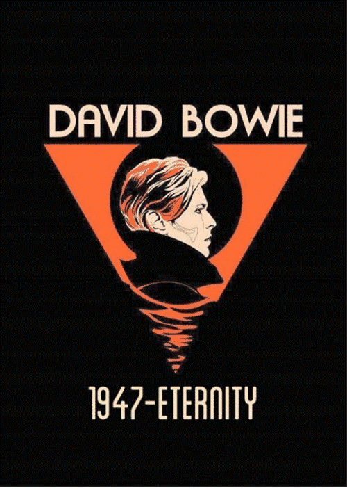

**_Αυτό το άρθρο δημοσιεύτηκε πρώτη φορά στις 10/01/2021 στο blog [V For Victoria](https://vforvictoria.gr/music/david-bowie-h-%ce%bc%ce%ad%cf%81%ce%b1-%cf%80%ce%bf%cf%85-o-stardust-%ce%b5%cf%80%ce%ad%cf%83%cf%84%cf%81%ce%b5%cf%88%ce%b5-%cf%83%cf%84%ce%b1-%ce%b1%cf%83%cf%84%ce%ad%cf%81%ce%b9%ce%b1/)._**

Ευχόμενος καλή χρονιά πριν από λίγες μέρες και σκεπτόμενος πότε ήθελα τόσο πολύ να φύγει ένα έτος παλιότερα, θυμήθηκα ότι το 2016 ήταν μια αξέχαστη χρονιά για τη μουσική βιομηχανία. Θυμάμαι χαρακτηριστικά πόσο ήθελα να φύγει και το θεωρούσα πολύ «γκαντέμικο». Από τις 10 Ιανουαρίου έδειξε εκείνο το έτος ότι είχε άσχημες διαθέσεις. Ήταν η μέρα που ο Stardust επέστρεψε στα αστέρια.

Ήταν μια περίεργη εβδομάδα. Ο Bowie μόλις είχε κυκλοφορήσει ένα από τα καλύτερα του album με τίτλο «Blackstar» και λίγες μέρες μετά την κυκλοφορία του, στις 10 Ιανουαρίου του 2016, μέσα από τους λογαριασμούς του στα μέσα κοινωνικής δικτύωσης, ανακοινώθηκε ότι «πέθανε ειρηνικά, περιτριγυρισμένος από την οικογένειά του, μετά από 18μηνη μάχη με τον καρκίνο». Ακόμα θυμάμαι το μούδιασμά μου, όταν διάβασα την είδηση.

Γεννημένος στις 8 Ιανουαρίου του 1947 στο Νότιο Λονδίνο, στο Brixton, ο David Robert Jones έκανε την πρώτη του επιτυχία με το «Space Oddity» το 1969. Άρχισε να παίζει σαξόφωνο σε ηλικία 13 ετών κι επηρεάστηκε σε μεγάλο βαθμό από τον αδερφό του Terry, ο οποίος ήταν εννέα χρόνια μεγαλύτερος του και έδειξε στον νεαρό Bowie τον κόσμο της ροκ μουσικής και της λογοτεχνίας. Όμως ο Terry είχε μια ψυχική ασθένεια, η οποία ανάγκασε την οικογένειά του να τον παραδώσει σε ένα ίδρυμα, γεγονός που στοίχειωσε τον Bowie. Ο Terry αυτοκτόνησε το 1985, μια τραγωδία που αποτέλεσε το επίκεντρο του τραγουδιού του Bowie «Jump They Say».

Το 1962 είχε ένα σοβαρό τραυματισμό στο σχολείο, όταν ο φίλος του George Underwood τον τραυμάτισε ρίχνοντάς του μια μπουνιά στο αριστερό μάτι κατά τη διάρκεια ενός τσακωμού για ένα κορίτσι. Μετά από μια σειρά χειρουργικών επεμβάσεων και μιας τετράμηνης νοσηλείας, οι γιατροί του αποφάσισαν ότι η ζημιά δεν μπορούσε να αποκατασταθεί πλήρως και ο Bowie έμεινε έχοντας πρόβλημα στην αντίληψη βάθους και ανισοκορία (διαφορά στη διάμετρο στις κόρες των ματιών). Ήταν μάλιστα τέτοια η διαφορά στα μάτια του -η κόρη του αριστερού του ματιού ήταν μονίμως διεσταλμένη- που έδινε την εντύπωση της ετεροχρωμίας, μιας εξαιρετικά σπάνιας κατάστασης, κατά την οποία κάθε μάτι έχει διαφορετικό χρώμα ίριδας. Το μάτι έγινε αργότερα ένα από τα πιο αναγνωρίσιμα χαρακτηριστικά του Bowie.  Παρά τη φιλονικία τους ο Bowie είχε πάντα καλές σχέσεις με τον Underwood, ο οποίος συνέχισε να δημιουργεί το εξώφυλλα για τα πρώτα άλμπουμ του Bowie.

Αφού αποφοίτησε από το Τεχνικό Γυμνάσιο Bromley στα 16, ο Bowie άρχισε να εργάζεται ως εμπορικός καλλιτέχνης και να ηγείται ενός συγκροτήματος που ονομαζόταν «Davy Jones and the Lower Third». Λόγω του φόβου του να μην τον μπερδέψουν με τον Davy Jones των «The Monkees» ο David άλλαξε το επώνυμό του σε Bowie, ένα όνομα που εμπνεύστηκε από το μαχαίρι που ανέπτυξε ο Αμερικανός πρωτοπόρος Jim Bowie τον 19ο αιώνα. Τελικά, ο Bowie ακολούθησε solo καριέρα και στις αρχές του 1969 υπέγραψε με τη «Mercury Records» κι εκείνο το καλοκαίρι κυκλοφορεί το single «Space Oddity». Ο Bowie ισχυρίστηκε αργότερα ότι εμπνεύστηκε το τραγούδι αφότου είδε την ταινία του Stanley Kubrick «2001: A Space Odyssey».

Το επόμενο άλμπουμ του Bowie, «The Man Who Sold the World», το 1970  τον απογείωσε και ήταν πιο ροκ από οτιδήποτε είχε κάνει στο παρελθόν. Καθώς ο Bowie έβλεπε την αναγνωρισιμότητά του να αυξάνεται χρόνο με τον χρόνο ισχυρίστηκε ότι ήταν gay κι έπειτα δημιούργησε τον Ziggy Stardust και τον σύστησε στον κόσμο. Το άλμπουμ του 1972 «The Rise and Fall of Ziggy Stardust and the Spiders from Mars» τον έκανε σούπερ σταρ και σηματοδότησε μια νέα εποχή στη ροκ μουσική.

Όσο γρήγορα μεταμορφώθηκε σε Stardust, τόσο γρήγορα άλλαξε ξανά και αξιοποίησε τη διασημότητά του εκτελώντας χρέη παραγωγού για τους Lou Reed και Iggy Pop. Το 1973 διαλύει τη Stardust περσόνα που δημιούργησε και με παρόμοιο glam rock στιλ κυκλοφορεί το άλμπουμ «Aladdin Sane».

Μέχρι τα μέσα της δεκαετίας του 1970 ο Bowie είχε υποστεί μια πλήρη αλλαγή και μέσα σε 2 χρόνια κυκλοφόρησε τα άλμπουμ «David Live» το 1974 και «Young American» το 1975.

Το 1980 ο Bowie, που πλέον ζούσε στη Νέα Υόρκη, κυκλοφόρησε το «Scary Monsters» και τρία χρόνια αργότερα ηχογράφησε το «Let’s Dance» ένα άλμπουμ που περιείχε πολλές επιτυχίες.

Φυσικά, τα ενδιαφέροντα του Bowie δεν αφορούσαν μόνο τη μουσική. Η αγάπη του για την υποκριτική τον βοήθησε να πάρει τον πρωταγωνιστικό ρόλο στο «The Man Who Fell to Earth» το 1976, ενώ το 1980 πρωταγωνίστησε στο Broadway στο «The Elephant Man». Το 1986 πρωταγωνίστησε στην ταινία «Labyrinth», σε σκηνοθεσία Jim Henson και σε παραγωγή του George Lucas.

Κατά την επόμενη δεκαετία η μουσική καριέρα του Bowie εξασθένησε. Κυκλοφόρησε δύο άλμπουμ, τα «Tin Machine» το 1989 και «Tin Machine II» το 1991, και το 1993 το «Black Tie White Noise», το οποίο περιέγραψε ο ίδιος ως δώρο γάμου για τη νέα του σύζυγο και super model Iman.

Το 2004, ο Bowie υπέστη καρδιακή προσβολή, ενώ ήταν στη σκηνή στη Γερμανία και αφού ανέρρωσε πλήρως συνέχισε να δουλεύει με συγκροτήματα όπως τους «Arcade Fire», καθώς και με την ηθοποιό Scarlett Johansson στο άλμπουμ της «Anywhere I Lay My Head» το 2008.

Διατήρησε ένα χαμηλό προφίλ για αρκετά χρόνια μέχρι την κυκλοφορία του άλμπουμ του «The Next Day» το 2013, το οποίο ανέβηκε στο Νούμερο 2 στα Billboard charts.  Τον επόμενο χρόνο ο Bowie κυκλοφόρησε μια μεγαλύτερη συλλογή επιτυχιών με τίτλο «Nothing Has Changed» και το 2015 συνεργάστηκε στο «Lazarus», ένα ροκ μιούζικαλ με πρωταγωνιστή τον Michael C. Hall.

Ο Bowie κυκλοφόρησε το «Blackstar», το τελευταίο του άλμπουμ, στις 8 Ιανουαρίου 2016, στα 69α γενέθλιά του. Δύο μέρες αργότερα άφησε την τελευταία του πνοή και ο κόσμος έμαθε ότι ο δίσκος είχε γίνει σε δύσκολες συνθήκες. Μάλιστα ο Tony Visconti, παραγωγός και φίλος του Bowie, έγραψε στο Facebook ότι ο τελευταίος δίσκος του ήταν «το δώρο του αποχωρισμού».

Ο Bowie άφησε μια εντυπωσιακή μουσική κληρονομιά, η οποία περιελάμβανε 26 άλμπουμ, την είσοδο του στο Rock and Roll Hall of Fame το 1996 και την απονομή του βραβείου Grammy Lifetime Achievement το 2006. Γνωστός ως μουσικός χαμαιλέοντας για τις συνεχείς αλλαγές της εμφάνισής του αλλά και του ήχου του, ήταν ηγετική προσωπικότητα στη μουσική βιομηχανία και θεωρείται ένας από τους πιο σημαντικούς μουσικούς του 20ού αιώνα. Ως μουσικός ενέπνευσε πραγματικά πολλούς και εμένα προσωπικά ως λάτρη της μουσικής. Είναι ένας από τους σπουδαιότερους καλλιτέχνες που έχει δει ο πλανήτης και παρόλο που το πνεύμα και η κληρονομιά του δεν πρόκειται να πεθάνουν ποτέ, νομίζω ότι η μουσική και η μαγεία του David Bowie λείπει πραγματικά σήμερα.

**#BowieForever**
