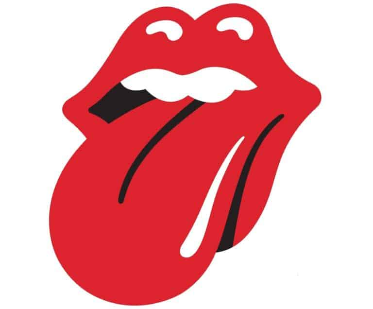
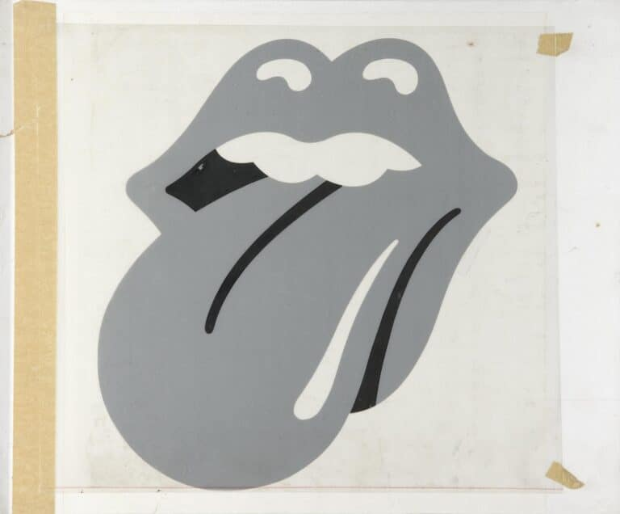
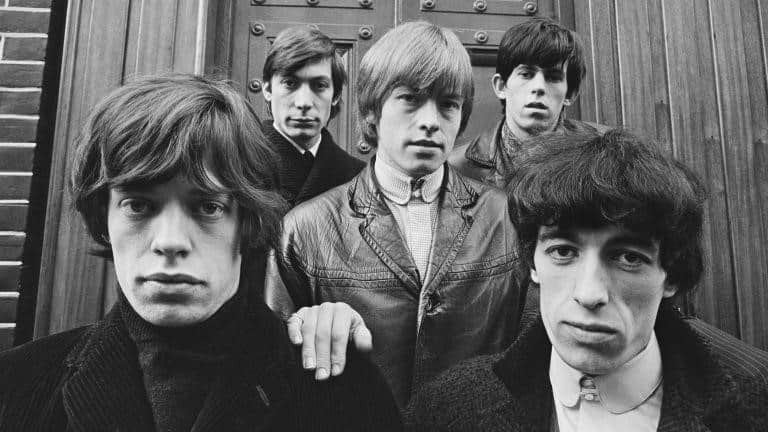

Μου αρέσουν πολύ οι ιστορίες και οι μύθοι που κρύβονται πίσω από μεγάλες ή μικρές στιγμές της μουσικής σκηνής. Πρόσφατα παρατηρούσα ότι υπάρχουν εκατοντάδες διάσημα λογότυπα τα οποία αντιπροσωπεύουν κυρίως εταιρείες, brands και προϊόντα.  Στη μουσική βιομηχανία, όμως, δεν υπάρχουν πολλά ή, για να είμαι ακριβής, δεν είναι πολλά αυτά που θυμόμαστε. Ένα από αυτά, ίσως και το δημοφιλέστερο, αντιπροσωπεύει τη μεγαλύτερη Rock’ N’ Roll μπάντα όλων των εποχών. Τους Rolling Stones.

Μια δημοσκόπηση το 2018 έχρισε αυτό το κλασικό λογότυπο των χειλιών και της γλώσσας, γνωστό και ως **Hot** **Lips** **logo**, ως το αγαπημένο όλων για t-shirt. Το λογότυπο των Stones έχει τυπωθεί παντού, από μπλουζάκια και μεταξωτές γραβάτες έως καπέλα του μπέιζμπολ και εσώρουχα. Φαντάζομαι πολλοί πιστεύετε ότι το λογότυπο αυτό βασίζεται στο πρόσωπο του frontman των Stones, Mick Jagger, έτσι δεν είναι;

Μμμμ… όχι ακριβώς.

Ποια είναι, λοιπόν, η ιστορία που κρύβεται πίσω από το διάσημο λογότυπο των Rolling Stones;

Το διάσημο αυτό λογότυπο κλείνει φέτος 50 χρόνια ιστορίας και εμφανίζεται για πρώτη φορά το 1971, όταν χρησιμοποιείται σε κάρτες VIP για την παράσταση των Rolling Stones στο Marquee Club του Λονδίνου.

Το λογότυπο σχεδιάστηκε από τον [John Pasche](https://www.johnpasche.com/), φοιτητή στο διάσημο Royal College of Art στο Λονδίνο (εκεί όπου σπούδασε επίσης ο Storm Thorgerson, ο οποίος σχεδίασε το εξώφυλλο των Pink Floyd – Dark Side of the Moon). Οι Rolling Stones χρειαζόντουσαν μια αφίσα για την ευρωπαϊκή περιοδεία τους, το 1970. Οι προτάσεις που είχαν από την τότε δισκογραφική τους εταιρεία Decca Records δεν τους άρεσαν. Έτσι, επικοινώνησαν με  τη σχολή για να βρουν έναν σπουδαστή, ο οποίος θα σχεδίαζε την αφίσα. Η σχολή προτείνει τον Pasche, ο οποίος ήταν στο τρίτο και τελευταίο έτος της σχολής. Επιλέχθηκε και συνάντησε τον Mick Jagger με τον οποίο συζήτησε τις ιδέες για την αφίσα. Μία εβδομάδα μετά επέστρεψε με το τελικό του σχέδιο στον Jagger, αλλά δεν ικανοποίησε καθόλου τον frontman των Stones και μάλλον, σύμφωνα με αυτά που έχει δηλώσει στο παρελθόν ο Pasche, δεν του άρεσε η σύνθεση και το χρώμα. Ο Pasche νόμιζε ότι εκεί τελείωσαν όλα, αλλά ο Jagger του είπε: “Είμαι σίγουρος ότι μπορείς να τα καταφέρεις καλύτερα John”.

Η δεύτερη και τελική version της αφίσας είχε την αισθητική των 30s – 40s και περιείχε ένα [Concorde Turbojet](https://www.pamono.com/the-rolling-stones-poster-by-john-pasche-1972/?utm_medium=cpc&utm_source=google&utm_campaign=PLA_US_6615042386_81833835514&utm_content=386255076362_c_&utm_term=pla-294682000766___VDY-593975). Το έργο πήγε καλά και τον Απρίλιο του 1970 ο Jo Bergman, προσωπικός βοηθός του συγκροτήματος, επικοινώνησε με τον Pasche ξανά, για να του αναθέσει ένα νέο έργο. Αυτήν τη φορά θα έπρεπε να δημιουργήσει ένα λογότυπο ή ένα σύμβολο που να μπορεί να χρησιμοποιηθεί σε επιστολόχαρτα, σε εξώφυλλα προγράμματος και σε εξώφυλλα για τα βιβλία τύπου. Λίγους μήνες μετά, σε συνάντηση που είχε ο Pasche με τον Jagger, σύμφωνα με δηλώσεις του πρώτου, ο Jagger ήθελε κάτι που να είναι πολύ απλό, όπως το λογότυπο της Shell. Επίσης, κατά τη διάρκεια εκείνης της συνάντησης ο Jagger του έδειξε μια εικόνα της ινδικής θεάς [Κάλι](https://en.wikipedia.org/wiki/Kali), που έβγαζε μια μακριά, μυτερή γλώσσα. Το ενδιαφέρον για την Ινδική κουλτούρα τότε στη Βρετανία ήταν της μόδας αλλά ο Pasche “κόλλησε” με το στόμα και τη γλώσσα της συγκεκριμένης εικόνας. Χρησιμοποιώντας αυτό ως βάση, ο Pasche βρήκε το λογότυπο της γλώσσας και των χειλιών, κερδίζοντας γι’ αυτή τη δουλειά 50£.

Σε αντίθεση με τη δημοφιλή πεποίθηση, το λογότυπο, που αρχικά δημιουργήθηκε σε ασπρόμαυρο, δεν προοριζόταν – τουλάχιστον σκόπιμα – να αντιπροσωπεύει τη γλώσσα και τα χείλη του Jagger.

Ο Pasche είχε δηλώσει ότι μπορεί να το έκανε υποσυνείδητα. Η ιδέα του σχεδιασμού για τη γλώσσα ήταν να αντιπροσωπεύει την αντι-αυταρχική στάση του συγκροτήματος, να είναι έντονο και συμπαγές, αλλά και ιδανικό σε μέγεθος, για να χωράει παντού και με σεξουαλικές αποχρώσεις.

Μετά το ντεμπούτο του στις κάρτες VIP, το λογότυπο εμφανίζεται σε ένθετο για το άλμπουμ Sticky Fingers, το οποίο διαθέτει ένα πραγματικό, φερμουάρ εργασίας στο εξώφυλλο που σχεδιάστηκε από τον Andy Warhol. Το λογότυπο είναι τόσο επιτυχημένο που το συγκρότημα το χρησιμοποιεί για την ετικέτα τους, Rolling Stones Records, και το βάζει σε κάθε επόμενο άλμπουμ, καθώς και το μεγαλύτερο μέρος των διαφημιστικών τους υλικών, μπλούζες και άλλων εμπορευμάτων.

> "Είναι ένα είδος καθολικής δήλωσης, κολλώντας τη γλώσσα σου σε κάτι", λέει ο Pasche. "Είναι πραγματικά μια διαμαρτυρία."

**_Αυτό το άρθρο δημοσιεύτηκε πρώτη φορά στις 31/03/2021 στο blog [V For Victoria](https://vforvictoria.gr/music/%ce%b7-%ce%b9%cf%83%cf%84%ce%bf%cf%81%ce%af%ce%b1-%cf%80%ce%af%cf%83%cf%89-%ce%b1%cf%80%cf%8c-%cf%84%ce%bf-%ce%b4%ce%b9%ce%ac%cf%83%ce%b7%ce%bc%ce%bf-%ce%bb%ce%bf%ce%b3%cf%8c%cf%84%cf%85%cf%80%ce%bf/)_**.
