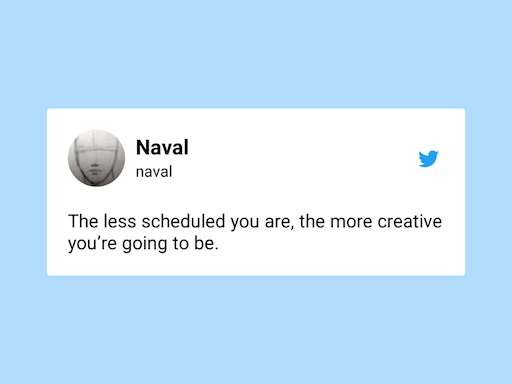

Είμαι άνθρωπος του "προγράμματος" και γενικά θα μπορούσα να πω ότι τις περισσότερες ώρες της ημέρας ξέρω τι θα κάνω...

Έτσι λειτουργώ καλύτερα, και το calendar μου όπως και άλλα προγράμματα που χρησιμοποιώ καθημερινά με βοηθάνε να οργανώνω τον χρόνο μου καλύτερα.

Όταν όμως δημιουργώ κάτι, ότι και αν είναι αυτό, συνήθως το κάνω σε στιγμές "αναρχίας" για τα δικά μου δεδομένα.

