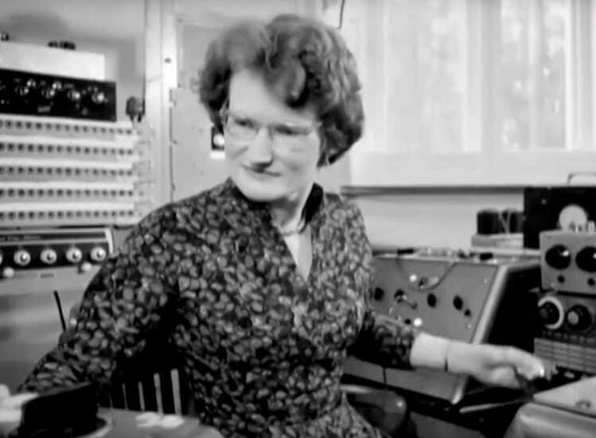
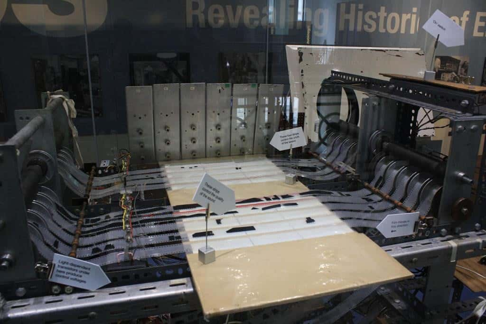
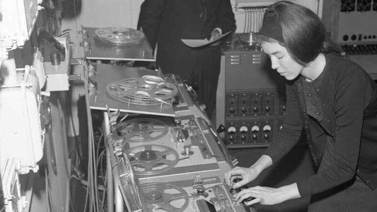

Η ιστορία της ηλεκτρονικής μουσικής επικεντρώνεται συνήθως στους άντρες. Οι Pierre Schaeffer, Olivier Messiaen, Pierre Boulez, Karlheinz Stockhausen και Edgard Varèse ήταν μερικοί από αυτούς που ανέπτυξαν μουσικά μοτίβα από ηχογραφημένους καθημερινούς ήχους στο Παρίσι στα μέσα του 20ού αιώνα. Ωστόσο, εκείνες τις δεκαετίες μια ομάδα μηχανικών ήχου -πολλές εκ των οποίων γυναίκες- έκαναν θραύση στο Λονδίνο.

Δύο πρωτοπόρες γυναίκες για την ιστορία της ηλεκτρονικής μουσικής δούλεψαν στο ραδιοφωνικό εργαστήριο του BBC (BBC Radiophonic Workshop). Ο λόγος για τις Daphne Oram και Delia Derbyshire, οι οποίες παρήγαγαν εφέ και μουσικά θέματα για τον βρετανικό ραδιοτηλεοπτικό οργανισμό, χρησιμοποιώντας ηλεκτρονικούς ταλαντωτές και λούπες ταινιών δεκαετίες πριν τα συνθεσάιζερ εμφανιστούν στο κοινό. Μέσα σε αυτά συμπεριλαμβάνονται οι εμβληματικοί ήχοι για τα τηλεοπτικά και ραδιοφωνικά προγράμματα επιστημονικής φαντασίας **_“Doctor Who”_** και **_“The Hitchhiker‘s Guide to the Galaxy”_**.

Η Daphne Oram (1925–2003) ήταν συνιδρύτρια του ραδιοφωνικού εργαστηρίου. Στη διάρκεια του Β’ Παγκοσμίου Πολέμου απόκτησε εμπειρία στη μίξη ηλεκτρονικών και μουσικής ενώ εργαζόταν στο BBC στη ρύθμιση του ήχου για τις ραδιοφωνικές εκπομπές. Μία από τις δουλειές της ήταν να «σκιάζει» (shadowing) ζωντανές συναυλίες με μια προ-ηχογραφημένη έκδοση των κομματιών, ώστε η μετάδοση να συνεχιστεί σε περίπτωση που διακοπεί από τη δράση του εχθρού.

Με αυτόν τον τρόπο, κατά τη διάρκεια των βομβαρδισμών του Λονδίνου από τους Γερμανούς (επιχείρηση Blitz), κατάφεραν οι μουσικοί να εγκαταλείψουν τον μεγάλο συναυλιακό χώρο της πόλης, το «Albert Hall», χωρίς να το αντιληφθεί το ραδιοφωνικό κοινό.

Στη δεκαετία του 1950, η Oram ενθουσιάστηκε από τη μαγνητοταινία και της δυνατότητές της, καθώς ήταν οπαδός του [_musique_ _concrète_](https://en.wikipedia.org/wiki/Musique_concr%C3%A8te), ενός τύπου μουσικής σύνθεσης που χρησιμοποιεί ηχογραφημένους ήχους ως πρώτη ύλη. Αυτοί οι ήχοι συχνά τροποποιούνται μέσω εφαρμογής ηχητικών εφέ και τεχνικών χειρισμού ταινιών και μπορούν στη συνέχεια να συναρμολογηθούν σε μορφή μοντάζ. Συνήθως ξενυχτούσε όλη τη νύχτα για να μιξάρει τα δικά της κομμάτια. Το 1958,  στο πλαίσιο του εκσυγχρονισμού της μουσικής του BBC και μετά από πολλές πιέσεις για πολλά χρόνια, δόθηκε στην Oram και στον συνάδελφό της Desmond Briscoe ένα δωμάτιο με παλιό εξοπλισμό. Έτσι, ξεκίνησε το ραδιοφωνικό εργαστήριο του BBC.

Τον Οκτώβριο του 1958, η Oram στάλθηκε από το BBC στο «Journées Internationales de Musique Expérimentale» στην Παγκόσμια Έκθεση των Βρυξελλών, εκεί όπου ο Edgard Varèse επέδειξε το _[Poème Électronique](https://en.wikipedia.org/wiki/Po%C3%A8me_%C3%A9lectronique),_ μια πρωτοποριακή μίξη ηλεκτρονικής μουσικής, αρχιτεκτονικής και εικαστικής τέχνης.

Αφού άκουσε μερικά από τα έργα που παράγονται από τους σύγχρονούς της και δυσαρεστημένη πλέον με τη συνεχιζόμενη άρνηση του τμήματος μουσικής του BBC να ωθήσει την ηλεκτρονική σύνθεση στο προσκήνιο των δραστηριοτήτων τους, αποφάσισε να παραιτηθεί από το BBC λιγότερο από ένα χρόνο μετά το άνοιγμα του εργαστηρίου, ελπίζοντας ότι θα αναπτύξει τις τεχνικές της από μόνη της.

Στη συνέχεια δημιούργησε το δικό της στούντιο σε ένα ανακαινισμένο αγροτικό σπίτι στο Κεντ. Συνέχισε να συνθέτει ηλεκτρονικούς ήχους, να δίνει διαλέξεις και να γράφει για τη φύση των δονήσεων.

https://youtu.be/SgHwPcukasQ

Στο διάστημα αυτό ανέπτυξε μια τεχνική «σχεδιασμένου» ήχου που ονόμασε Oramics.

Σχήματα και σχέδια χαραγμένα στις ταινίες διαβάζονται από φωτο-ηλεκτρικά κελιά και μετατρέπονται σε ήχους. Σύμφωνα με την Oram, «Κάθε απόχρωση, κάθε λεπτότητα της διατύπωσης, κάθε διαβάθμιση τόνου ή κλίση βήματος πρέπει να είναι δυνατή μόνο με μια αλλαγή στη γραπτή μορφή».

Oramics

Η τεχνική Oramics και η ευελιξία του ελέγχου των αποχρώσεων του ήχου ήταν μια εντελώς νέα και καινοτόμος προσέγγιση στην παραγωγή μουσικής.

Στην πραγματικότητα το Oramics ήταν ένα πρώτο sequencer -μια τεχνολογία που τελικά ήρθε στη δεκαετία του 1980.

Η Oram άνοιξε το δρόμο για την Delia Derbyshire (1937-2001), η οποία φημίζεται για τη θεματική μουσική στη βρετανική τηλεοπτική σειρά επιστημονικής φαντασίας **«Doctor Who»** το 1963.

H αγάπη της Delia για τους αφηρημένους ήχους, όπως η ίδια είχε δηλώσει, προήλθε από τις σειρήνες των αεροπορικών επιδρομών που άκουγε, όταν μεγαλώνε στο Κόβεντρυ κατά τη διάρκεια του Blitz.

Σε ηλικία 8 ετών οι γονείς της της αγόρασαν ένα πιάνο. Εκπαιδεύτηκε στο Barr’s Hill Grammar School από το 1948 έως το 1956 και έγινε δεκτή τόσο στην Οξφόρδη όσο και στο Κέιμπριτζ, **_«κάτι πραγματικά σπάνιο για ένα κορίτσι εργατικής τάξης τη δεκαετία του ’50, όπου μόνο ένας στους 10 μαθητές ήταν γυναίκες»_**. Μετά από έναν χρόνο στο Κέιμπριτζ, αποφοίτησε το 1959 με πτυχίο στα μαθηματικά και τη μουσική, έχοντας ειδικευτεί στη μεσαιωνική και σύγχρονη μουσική ιστορία. Στο τέλος των σπουδών της, πλησιάζοντας το γραφείο σταδιοδρομίας του πανεπιστημίου, τους είπε ότι ενδιαφέρεται για ήχο, μουσική και ακουστική και στη συνέχεια υπέβαλε αίτηση για θέση στη Decca Records, η οποία απορρίφθηκε, καθώς της είπαν ότι δεν απασχολούνταν γυναίκες στα στούντιό τους.

Έτσι, το 1960 έγινε μέλος του BBC ως βοηθός διευθυντή στούντιο. Το 1962 ζήτησε τη μεταφορά στο ραδιοφωνικό εργαστήριο του BBC και παρέμεινε εκεί μέχρι το 1973.

Οι πρώτες δουλείες της Derbyshire περιελάμβαναν μουσική για το ντοκιμαντέρ «Time On Our Hands» (1962) και άλλα θέματα για μικρότερους τίτλους, όπως το «Know Your Car» (1963). Το μουσικό θέμα, όμως, για το original soundtrack του «Doctor Who» συνέβαλε πολύ εκείνη την εποχή στην εκτίμηση του κοινού όσον αφορούσε την ηλεκτρονική μουσική στη Βρετανία.

https://youtu.be/75V4ClJZME4

Και εάν το μουσικό θέμα του «Doctor Who» εξακολουθεί να είναι το πιο γνωστό κομμάτι της «Delian», η συνεργασία της με τον δραματουργό Barry Bermange στις ραδιοφωνικές εκπομπές «Τέσσερις εφευρέσεις για το ραδιόφωνο», που μεταδόθηκε για πρώτη φορά το 1964 και το 1965, θα της επέτρεπε να αναπτύξει τις ιδέες της σε έναν πολύ μεγαλύτερο καμβά. Αυτά τα τέσσερα έργα δημιούργησαν ένα ξεχωριστό είδος ραδιοφωνικής εκπομπής, συνδυάζοντας την ηλεκτρονική μουσική και τα ηχητικά backgrounds με ένα ποιητικό κολάζ συνεντεύξεων με το κοινό. Οι εφευρέσεις ήταν αξιοσημείωτες τόσο για το τεχνικό τους επίτευγμα, όσο και για το γεγονός ότι ακούστηκαν οι φωνές των καθημερινών ανθρώπων και οι σκέψεις τους σχετικά με βαριά φιλοσοφικά θέματα, όπως η πιθανότητα ζωής μετά το θάνατο και η εμπειρία της γήρανσης.

Συνεργάστηκε με σημαντικές προσωπικότητες στη βρετανική καλλιτεχνική σκηνή, όπως τον Peter Hall και τη Royal Shakespeare Company, αλλά και τους Yoko Ono και Ted Hughes, ενώ είχε και μια εκτεταμένη συνεργασία τη δεκαετία του 1970 με τους πρωτοπόρους καλλιτέχνες Elsa Stansfield και Madelon Hooykaas.  Το 1973 έφυγε από το ραδιοφωνικό εργαστήριο και μετεγκαταστάθηκε στα βορειοανατολικά Cumbria για αρκετά χρόνια, προτού επιστρέψει στο Λονδίνο το 1978 και έπειτα εγκαταστάθηκε στο Northampton με τη σύντροφό της, Clive Blackburn.

https://youtu.be/nXnmSgaeGAI

Συναυλίες και νέα έργα παρουσιάζονται όλο και περισσότερο προς τιμήν της, κυρίως μέσω της εκπαιδευτικής φιλανθρωπίας [Delia Derbyshire Day](https://deliaderbyshireday.com/).

**_Αυτό το άρθρο δημοσιεύτηκε πρώτη φορά στις 08/03/2021 με αφορμή την παγκόσμια ημέρα της γυναίκας στο blog [V For Victoria](https://vforvictoria.gr/music/%ce%b4%cf%8d%ce%bf-%cf%80%cf%81%cf%89%cf%84%ce%bf%cf%80%cf%8c%cf%81%ce%b5%cf%82-%ce%b3%cf%85%ce%bd%ce%b1%ce%af%ce%ba%ce%b5%cf%82-%cf%83%cf%84%ce%b7%ce%bd-%ce%b7%ce%bb%ce%b5%ce%ba%cf%84%cf%81%ce%bf/)_**.
