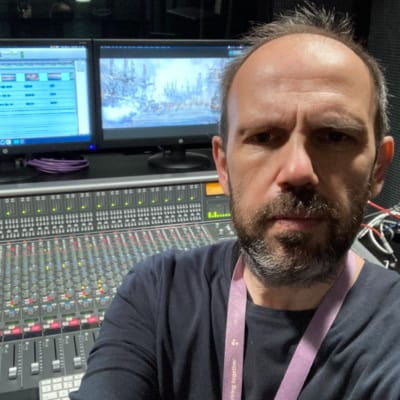

Ο ηχολήπτης - sound designer Γιώργος Μικρογιαννάκης μιλάει στο 10ο επεισόδιο του Be Κουτοί για τον ήχο που υπηρετεί με αφοσίωση εδώ και πολλά χρόνια.

Μια συζήτηση που μας πήγε από τη δισκογραφία στην τηλεόραση και από τη διαφήμιση στον κινηματογράφο.

* * *

**_Giorgos Mikrogiannakis_**

[Facebook:](https://www.facebook.com/gmikro) https://www.facebook.com/gmikro - [Website](https://gmikro.com/): https://gmikro.com/

**Βρείτε μας στο Instagram:**

[**_Aris Gerontakis_**](https://www.instagram.com/arisger) @arisger

[**_Giannis Chrysogono_**](https://www.instagram.com/gchrysogonou)[**_u_**](https://www.instagram.com/gchrysogonou) @gchrysogonou

**Email: bekoutoi@gmail.com**

<iframe src="https://anchor.fm/bekoutoi/embed/episodes/Episode-010-e1334hs" height="102px" width="400px" frameborder="0" scrolling="no"></iframe>

