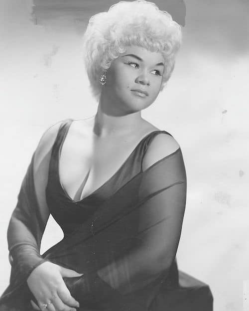
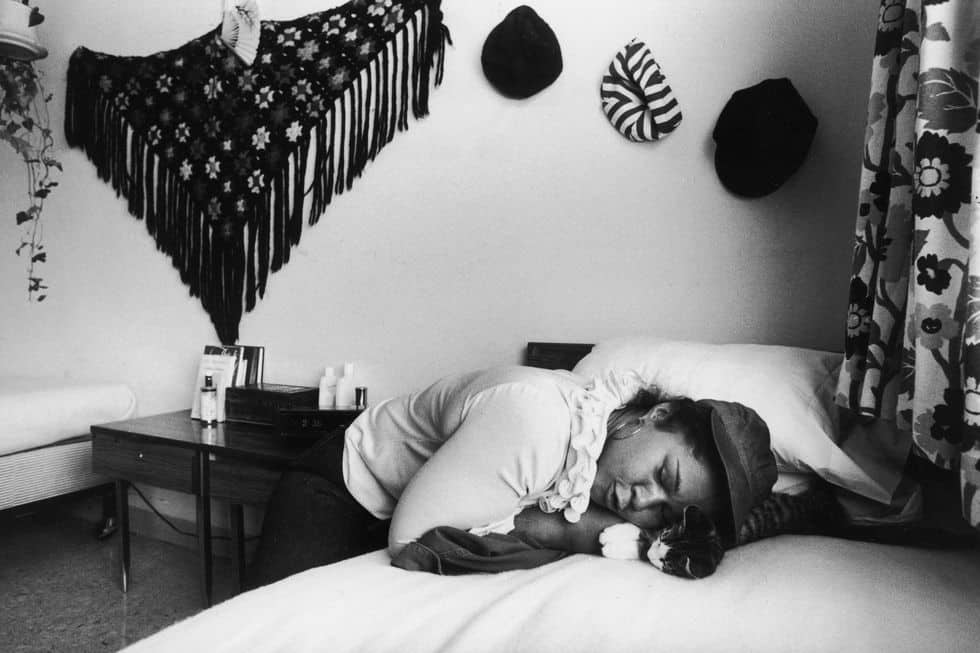
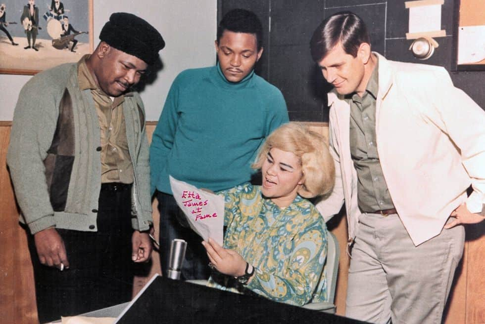
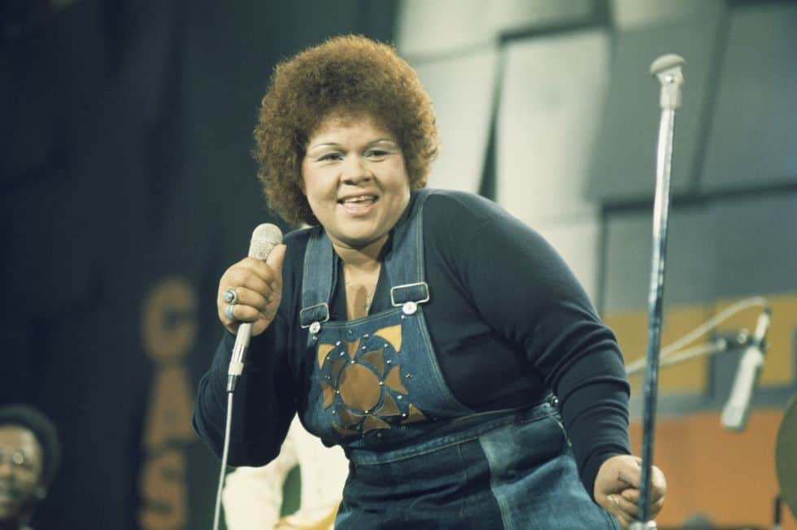
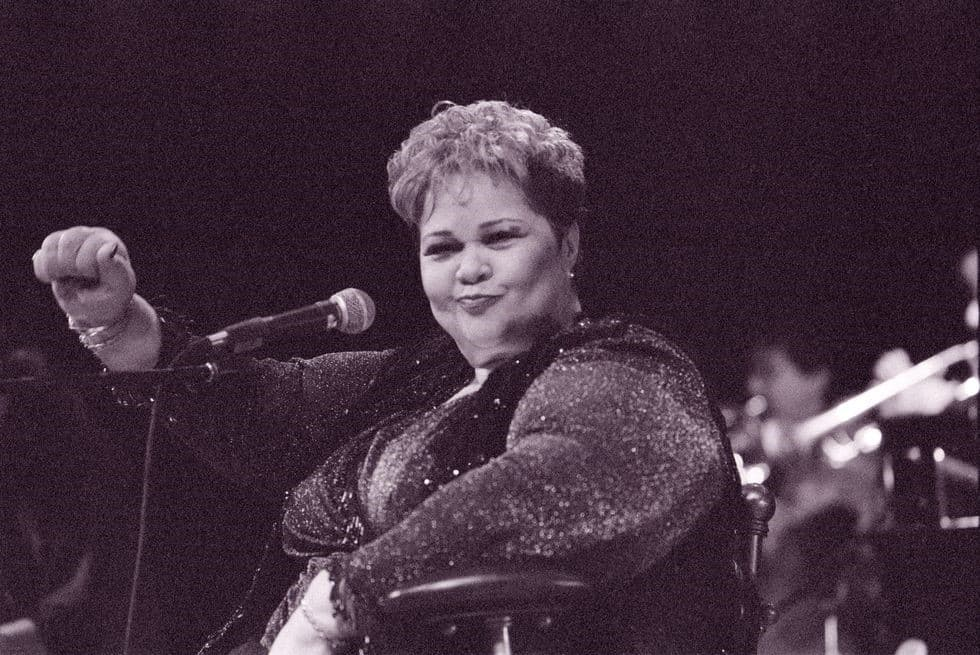

Λίγες γυναικείες φωνές κατάφεραν στο πάνθεον της μουσικής να απολαύσουν τη συνεχή αναγνώριση σε μια καριέρα που εκτείνεται σε έξι δεκαετίες και ο τίτλος _«Η μεγαλύτερη από όλες τις σύγχρονες τραγουδίστριες blues»_ που της είχε απονέμει κάποια στιγμή ο δημοσιογράφος και παραγωγός Gerald “Jerry” Wexler δικαιωματικά της αξίζει. Τραγούδησε από blues, R&B και soul μέχρι rock n’ roll, jazz και gospel.

Ο λόγος για τη **Jamesetta Hawkins**, γνωστή ως **Etta James** η οποία γεννήθηκε σαν σήμερα στις 25 Ιανουαρίου του 1938 στο Λος Άντζελες της Καλιφόρνια και πέθανε στις 20 Ιανουαρίου του 2012. Ήταν η σπουδαιότερη τραγουδίστρια που ηχογράφησε ποτέ για την [Chess Records](https://en.wikipedia.org/wiki/Chess_Records) και έζησε μια σκληρή ζωή που θα μπορούσε να εμπνεύσει για σενάριο σαπουνόπερας.

Η 14χρονη μητέρα της, Dorothy Hawkins, την ενθάρρυνε να κάνει καριέρα στο τραγούδι και ήδη από την ηλικία των 5 ετών η Jamesetta ήταν γνωστή ως παιδί – θαύμα της Gospel τραγουδώντας στη χορωδία της εκκλησίας και στο ραδιόφωνο.

Σε ηλικία 12 ετών μετακόμισε βόρεια στο Σαν Φρανσίσκο, όπου δημιούργησε ένα doo-wop trio με την ονομασία **Creolettes**. Τέσσερα χρόνια αργότερα, το 1954, ηχογραφεί με το συγκρότημα Otis το _«Roll_ _with_ _Me, Henry»,_ το οποίο έγινε αμέσως επιτυχία, αλλά με τον τίτλο _«The_ _Wallflower»,_ καθώς η αρχική version του κομματιού θεωρήθηκε λίγο ριψοκίνδυνη, για να παιχτεί σε pop ραδιοφωνικούς σταθμούς λόγω των σεξουαλικών υπονοούμενων και έτσι εκτός από τον τίτλο άλλαξαν και οι στίχοι σε _“Dance_ _with_ _Me, Henry”_. Εκείνη τη χρονιά μετονομάστηκε η ίδια σε **Etta** **James** (μία σύντομη έκδοση του ονόματός της) και το group της σε **«**The Peaches**»**. Λίγο αργότερα, η James ξεκίνησε τη σόλο καριέρα της με επιτυχίες όπως το _«Good_ _Rockin‘ Daddy»_ το 1955.

Αφότου υπέγραψε με την Chess Records το 1960, η καριέρα της άρχισε να ανεβαίνει με μπαλάντες όπως τα _«__All_ _I_ _Could_ _Do_ _Was_ _Cry__», «__At_ _Last__»_ και το _«__Trust_ _in_ _Me__»._

Ωστόσο, το ταλέντο της James δεν προοριζόταν μόνο για μπαλάντες, αλλά και για Gospel Rock’N’Roll μελωδίες που θα ξεσήκωναν το κοινό και αυτό έκανε με τα κομμάτια _«__Something__‘__s_ _Got_ _a_ _Hold_ _On_ _Me__»_  το 1962 και το _«__In_ _The_ _Basement__»_ το 1966, για να επιστρέψει το 1968 με μια ακόμη μπαλάντα με τίτλο _«__I__‘__d_ _Rather_ _Go_ _Blind__»._

Η James συνέχισε μέχρι τις αρχές της δεκαετίας του ‘70 με την Chess Records, αλλά ο εθισμός της στην ηρωίνη την επηρέασε τόσο προσωπικά όσο και επαγγελματικά. Ωστόσο, παρά τα συνεχή προβλήματα με τα ναρκωτικά, η ίδια επέμεινε στη δημιουργία νέων άλμπουμ. Έτσι, το 1967 ηχογράφησε με το group **Muscle** **Shoals** στα στούντιο **Fame** το 7o άλμπουμ της με τίτλο _«Tell_ _Mama»_ και ήταν το πρώτο της άλμπουμ από το 1964 που μπήκε στο **Billboard** **chart 200**. Μάλιστα το ομώνυμο single _«Tell_ _Mamma»_ έφτασε στο Νο 23 του **Billboard** **Hot 100.**

Το 1973 το 10ο άλμπουμ της Etta James προτάθηκε για βραβείο Grammy για τον δημιουργικό συνδυασμό rock και funk ήχων και μετά την ολοκλήρωση του συμβολαίου της με την Chess Records το 1977 υπογράφει συμβόλαιο με τη **Warner**. Με ένα πιο ανανεωμένο προφίλ, λοιπόν, ακολουθεί η εμφάνισή της στην τελετή έναρξης των Ολυμπιακών Αγώνων του Λος Άντζελες το 1984.

Λίγο πριν υπογράψει ένα νέο συμβόλαιο με την **Private** **Records** το 1993, η James εντάχθηκε στο **Rock** **and** **Roll** **Hall** **Of** **Fame** και συνέχισε να ηχογραφεί, με αποτέλεσμα στα 90s και με οδηγό την εξαιρετική φωνή της να ανέβει στην κορυφή του **Jazz** **Billboard** με το _«Blue_ _Gardenia»._

To 2003 υποβλήθηκε σε επέμβαση γαστρικού bypass και έχασε πάρα πολλά κιλά.

Αυτή η δραματική απώλεια βάρους είχε αντίκτυπο στη φωνή της και, όπως είχε πει η ίδια σε συνέντευξή της, μπορούσε να τραγουδήσει χαμηλότερα, ψηλότερα και πιο δυνατά. Έτσι εκείνη τη χρονιά κυκλοφορεί το _«Let’s_ _Roll»,_ το οποίο κερδίζει το βραβείο **Grammy** ως το καλύτερο σύγχρονο blues άλμπουμ, με τους γιους της να είναι παραγωγοί της ηχογράφησης μαζί με τον Josh Sklair. Κι επειδή ομάδα που κερδίζει δεν αλλάζει, όπως συνήθως λέμε, η ίδια ομάδα τής έδωσε και το τρίτο βραβείο Grammy έναν χρόνο αργότερα, το 2004, με το _«Blues_ _to_ _the_ _Bone»,_ αυτήν τη φορά για το καλύτερο παραδοσιακό άλμπουμ blues.

Το 2006 κυκλοφόρησε το άλμπουμ _«__All_ _the_ _Way__»_, το οποίο περιελάμβανε διασκευές τραγουδιών των Prince , Marvin Gaye και James Brown, και την επόμενη χρονιά συμμετείχε σε ένα άλμπουμ – αφιέρωμα για την Ella Fitzgerald με τίτλο _«__We_ _Love_ _Ella__»._

Το 2008 η ιστορία των πρώτων ημερών της Chess Records έγινε κινηματογραφική ταινία με τίτλο [**Cadillac** **Records**](https://www.imdb.com/title/tt1042877/). Αυτή η ταινία έγινε αφορμή για μια διαμάχη μεταξύ της Etta James και της **Beyoncè,** η οποία υποδύθηκε την Etta James στην εν λόγω ταινία και ηχογράφησε επίσης τη δική της εκδοχή του τραγουδιού _«At_ _Last»_ για το soundtrack. Ενώ η ίδια η James είχε υποστηρίξει δημοσίως την ταινία, όταν η Beyoncè τραγούδησε το τραγούδι στο παραδοσιακό inaugural ball του Προέδρου Μπαράκ Ομπάμα τον Ιανουάριο του 2009, έδειξε ενοχλημένη που  δεν είχε κληθεί να ερμηνεύσει το τραγούδι και φέρεται να είπε ότι η Beyoncè _«δεν είχε καμία δουλειά να τραγουδήσει το τραγούδι μου που εγώ τραγουδούσα πάντα»._

Αργότερα την ίδια εβδομάδα η James είπε στους «The New York Times» ότι η δήλωση προοριζόταν ως αστείο: «_Δεν εννοούσα τίποτα … Ακόμη και ως μικρό παιδί είχα πάντα αυτό το είδος κωμικής συμπεριφοράς»._

https://youtu.be/HGrq1SzkHs0

Καθώς μπήκε στα 70 της, άρχισε να αντιμετωπίζει προβλήματα υγείας. Νοσηλεύτηκε το 2010 για λοίμωξη αίματος μαζί με άλλες ασθένειες και αργότερα αποκαλύφθηκε ότι λάμβανε θεραπεία για λευχαιμία και ότι υπέφερε από άνοια -ο γιος της μάλιστα ισχυρίστηκε ότι αυτή ήταν η πιθανή αιτία των εκρήξεών της σχετικά με την Beyoncè Knowles. Κυκλοφόρησε το τελευταίο στούντιο άλμπουμ της με τίτλο _«The_ _Dreamer»_ τον Νοέμβριο του 2011, το οποίο έλαβε θερμές κριτικές. Στις 20 Ιανουαρίου του 2012, μόλις 3 μέρες μετά τον θάνατο του μέντορά της **Johnny** **Otis**, η James πέθανε στο σπίτι της στο Riverside της Καλιφόρνια σε ηλικία 73 ετών.

Ο Keith Richards στα απομνημονεύματά του με τίτλο «Life» τόνιζε ότι η Etta James είχε «μια φωνή που θα μπορούσε να σε οδηγήσει στην κόλαση ή στον παράδεισο». Στο «**Rage** **To** **Survive»**, την αυτοβιογραφία της James, είναι πολύ ξεκάθαρο ότι παρόλο που η προσωπική της ζωή ήταν γεμάτη δαίμονες, το έμφυτο ταλέντο, η εκπληκτική φωνή και η αποφασιστικότητά της, της έδωσαν τη σωτηρία.

> **“My mother always told me, even if a song has been done a thousand times, you can still bring something of your own to it. I’d like to think I did that.”**
> 
> **Etta James**

**_Αυτό το άρθρο δημοσιεύτηκε πρώτη φορά στις 10/01/2021 στο blog V For Victoria._**

https://open.spotify.com/playlist/37i9dQZF1DZ06evO06QCf6
