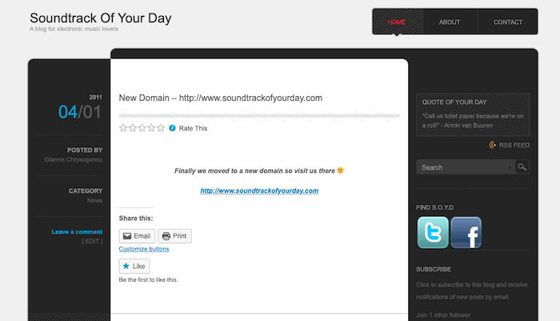

Η ιδέα του να δημιουργήσω ένα blog δεν είναι καινούργια.

Είναι ένα τόσο δα μικρόβιο που τριγυρνά μέσα μου από παλιά.  
Ας τα πάρουμε όμως τα πράγματα από την αρχή!

10 χρόνια πριν, το 2010 αν θυμάμαι καλά, είχα δημιουργήσει το Soundtrack Of Your Day.  
Ξεκίνησε ως μια απλή ιδέα του να γράφω για την ηλεκτρονική μουσική και ότι είχε να κάνει σε σχέση με την κουλτούρα αυτής της σκηνής καθώς και στο να μοιράζομαι άρθρα, dj sets, video κλπ.  
Ήταν γραμμένο στα αγγλικά αλλά η αλήθεια είναι ότι δεν περίμενα ότι θα το διαβάσει κανείς. Το ξεκίνησα επειδή ήθελα να έχω ένα χώρο στο οποίο θα μαζεύω όλα αυτά που έβρισκα και μου άρεσαν για το συγκεκριμένο θέμα.

Μερικούς μήνες μετά αφού ανέβαζα νέα πράγματα συνεχώς ήρθε ένα email:

_**Καλησπέρα, θα ήθελες να σου στέλνουμε νέα αν θες να τα δημοσιεύεις στη σελίδα σου;**_

Ήταν από μια δισκογραφική και μετά ήρθε και άλλο email αυτή τη φορά από ένα agency που έκανε promotion σε διάφορους καλλιτέχνες και μετά ακολούθησαν πολλά ακόμα.  
Παράλληλα είχα και ένα podcast το WeekenderMix όπου φιλοξενούσα και guest dj-set από διάφορους παραγωγούς και djs και ένα χρόνο μετά το 2011 το hosting του wordpress αποδείχτηκε πολύ μικρό και αγόρασα το domain soundtrackofyourday.com.

To Soundtrack Of Your Day blog - 2011

Έτσι αυτό το μικρό blog μετατράπηκε σε site με συνεντεύξεις, διαγωνισμούς και πολλά άλλα.  
Για να μην πολυλογώ είχε αρκετή επισκεψιμότητα και ήταν όλα τέλεια, μέχρι που 4 χρόνια μετά έφαγε ένα καλό χακάρισμα!

Ήρθε η απογοήτευση, συνέπεσε με μια περίεργη φάση της ζωής μου όπου έτρεχα με την κατασκευή και την έναρξη του [studio](http://soundslike.eu/) καθώς και με τη γέννηση του μικρού Λεωνίδα (ναι είμαι μπαμπάς) και επειδή δεν είχα πολύ χρόνο για να το ξαναστήσω όλο αυτό από την αρχή το μετέφερα για λίγο στο tumblr όπου τελικά δε με βοηθούσε ως πλατφόρμα για αυτά που σκεφτόμουν και ήθελα να κάνω και τελικά το παράτησα.

Η αλήθεια είναι πως πολλές φορές σκέφτομαι πως θα ήταν η ζωή μου σήμερα αν είχα ακόμα αυτό το blog.

Κάπως έτσι φτάσαμε 10 χρόνια μετά έχοντας αυτή τη μικρή εμπειρία στο “blogging” να είμαι πάλι εδώ, πάνω από το πληκτρολόγιο και έχοντας πάρει την απόφαση να δημιουργήσω αυτή τη φορά κάτι διαφορετικό.

#### Ένα προσωπικό blog.

### **Όμως ποιοι είναι οι λόγοι που με οδήγησαν να φτιάξω πάλι ένα blog;**

Απαντώντας σε αυτή την ερώτηση μπορεί να βρεις την ώθηση που θέλεις για να φτιάξεις το δικό σου blog.

**_1\. Γιατί θέλω να γράφω_**

Στο σχολείο δεν τα πήγαινα και πολύ καλά με το γράψιμο. Δε μου άρεσε να γράφω και μπορώ να πω ότι γενικά ήμουν ένας μέτριος μαθητής. Μεγαλώνοντας όμως άρχισα να απολαμβάνω το γράψιμο (κυρίως στον υπολογιστή), να κρατάω σημειώσεις και τον τελευταίο καιρό προσπαθώ να γράφω και σε σημειωματάρια. Με βοηθάει στο να ηρεμώ, να κάνω τις σκέψεις μου διαυγείς και επίσης καταφέρνω με αυτό το τρόπο να εντοπίζω τα προβλήματα στους συλλογισμούς μου. Επίσης, μου αρέσει να γράφω γιατί απλά θέλω να μοιραστώ κάτι, όπως κάνω αυτή τη στιγμή.

**_2\. Γιατί μου αρέσει να μαθαίνω να μοιράζομαι αυτά που βρίσκω και να βοηθάω_**

Είμαι ένας “content junkie”.  
Μου αρέσει να μαθαίνω και δε θέλω να κρατάω τα ενδιαφέροντα πράγματα που βρίσκω μόνο για μένα, θέλω να τα μοιράζομαι με άλλους.  
Διαβάζω blogs και βιβλία παρακολουθώ εκατοντάδες YouTube videos και podcasts, ακούω άπειρες ώρες μουσική και κρατάω πολλές σημειώσεις.  
Με τη δημοσίευση μέρους αυτής της δουλειάς που κάνω ούτως ή άλλως στο blog μου θα μπορέσω να οργανώσω καλύτερα όλες μου τις σημειώσεις και εκτός αυτού μπορεί επίσης να βοηθήσει κάποιον άλλον στο μέλλον.

**_3\. Γιατί μου αρέσει να γνωρίζω ανθρώπους και να επικοινωνώ_**

Ναι, με το blogging μπορείς να γνωρίσεις πολλούς ανθρώπους από όλο τον πλανήτη. Με το Soundtrack Of Your Day κατάφερα να γνωρίσω πολλούς με τους οποίους μας ένωνε η αγάπη μας για τη μουσική.  
Με πολλούς από αυτούς κρατώ ακόμα και σήμερα επαφή παρόλο που δεν υπάρχει το blog και μάλιστα μερικοί από αυτούς δεν ασχολούνται πια επαγγελματικά με τη μουσική. Τέλος, η επικοινωνία με τον κόσμο μέσω του blog είναι συναρπαστική.

**_4\. Γιατί μου αρέσει να δημιουργώ_**

Ok, αυτό ίσως είναι το μεγαλύτερο κίνητρο μου.  
Δεν μπορώ να διανοηθώ ότι θα πάψω να δημιουργώ. Από το πιο μικρό όπως το να ζωγραφίσω μια μουτζούρα παρέα με τον γιο μου μέχρι το μεγαλύτερο project του να δημιουργήσω ως sound designer τον ήχο για ένα ντοκιμαντέρ μια ταινία ή ένα διαφημιστικό κλπ.

> **Το blog δεν είναι ένα μέσο προώθησης για όλα αυτά που δημιουργείς αλλά ο καμβάς για να συνεχίσεις να δημιουργείς καθημερινά.**

Αυτοί είναι οι βασικοί λόγοι που με οδήγησαν να φτιάξω αυτό το blog και ελπίζω αυτή τη φορά να blogάρω για πολλά χρόνια!

Εσύ το σκέφτεσαι ακόμα να ξεκινήσεις το δικό σου blog;  
Αν θες να ακούσεις την άποψη μου, μην το σκέφτεσαι, [**απλά ξεκίνα**](http://gchrysogonou.gr/echeis-skeftei-ti-tha-synevaine-an-aplos/)!
