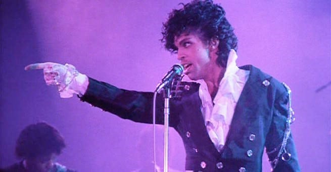
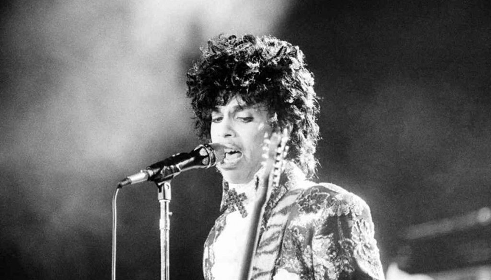
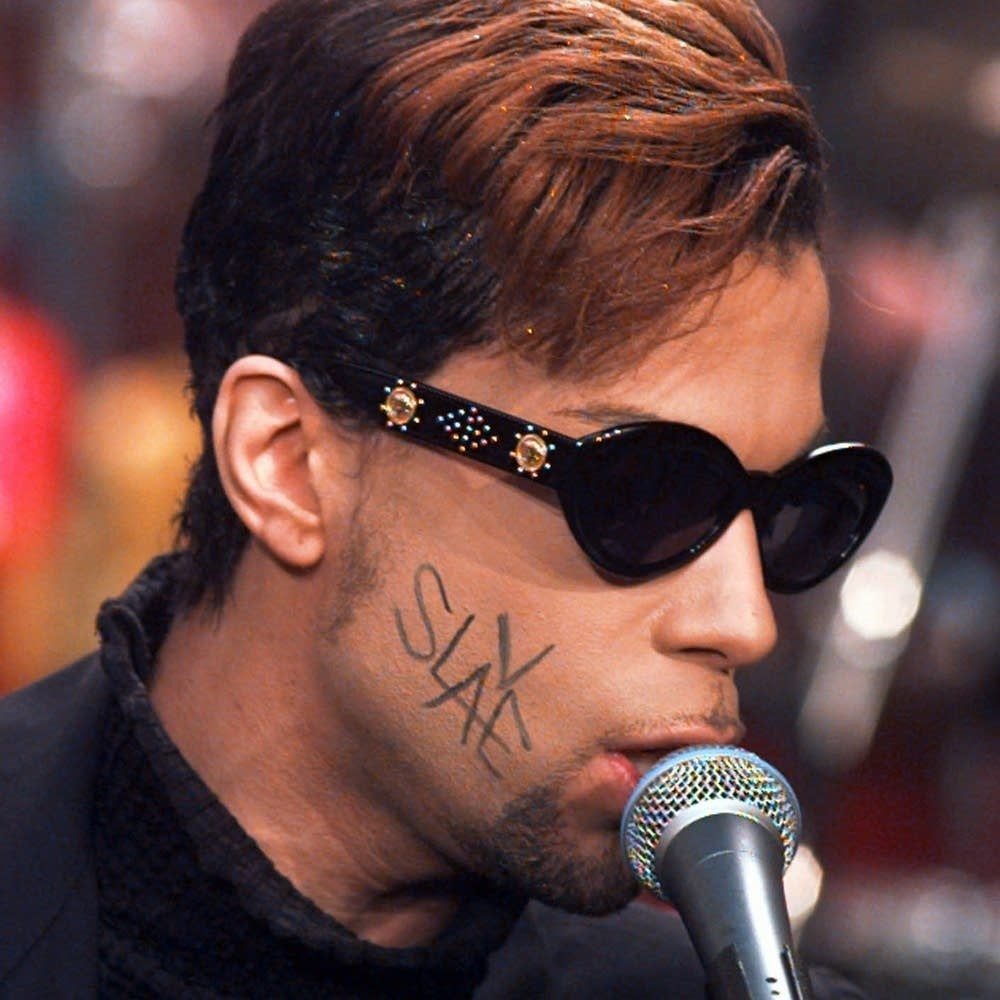

Έχουν περάσει 5 χρόνια από τη μέρα που ο Prince βρέθηκε μόνος και χωρίς να έχει τις αισθήσεις του σε ανελκυστήρα στο συγκρότημα του Paisley Park στις 21 Απριλίου 2016.

Ο θάνατός του σε ηλικία 57 ετών σόκαρε και προκάλεσε θλίψη σε όλους τους μουσικόφιλους στον πλανήτη, καθώς ήρθε μερικούς μήνες μετά τον θάνατο του David Bowie. Επίσης, προκάλεσε και την έρευνα από τις ομοσπονδιακές αρχές, προκειμένου να μάθουν τα αίτια του θανάτου, αφού μετά από την αυτοψία διαπιστώθηκε ότι πέθανε από υπερβολική δόση φαιντανύλης, ένα συνθετικό οπιοειδές 50 φορές πιο ισχυρό από την ηρωίνη. Ωστόσο, ο δικηγόρος της κομητείας του Carver, Mark Metz, δήλωσε μερικά χρόνια αργότερα ότι ο Prince πίστευε ότι έπαιρνε ένα κοινό παυσίπονο, το Vicodin, αλλά αντ ‘ αυτού πήρε ένα πλαστό Vicodin, συνδυασμένο με φαιντανύλη. Ο Metz είπε ότι παραμένει ένα μυστήριο για το πώς ο Prince έλαβε τα θανατηφόρα χάπια που έπαιρνε ή από ποιον, καθώς δεν υπήρχαν αρκετές αποδείξεις, για να διωχθεί κάποιος για έγκλημα σε σχέση με τον θάνατό του.

Οι εικόνες και τα βίντεο του Prince και του εσωτερικού του Paisley Park την ημέρα που βρέθηκε νεκρός δεν δίνουν καμία απάντηση γι’ αυτές τις ερωτήσεις. Μάλιστα σε έγγραφα που περιλαμβάνουν και συνεντεύξεις από τον στενό κύκλο του Prince, ο Johnson, ο σωματοφύλακάς του και διαχειριστής των ακινήτων του, είχε πει στους ανακριτές πως είχε παρατηρήσει τον Prince «να φαίνεται λίγο αδύναμος»  και ότι δεν είχε συνειδητοποιήσει πως το αφεντικό του είχε εθισμό στα οπιοειδή, έως ότου λιποθύμησε σε αεροπλάνο μια εβδομάδα πριν πεθάνει.

Ας πάρουμε τα πράγματα, όμως, από την αρχή, για να δούμε ποια ήταν η καριέρα του «Πρίγκιπα».

Ήταν άραγε ο μεγάλος θόρυβος του θανάτου του Prince αντίστοιχος του θορύβου που έκανε στη ζωή του ως μουσικός;

### **_Τα πρώτα χρόνια_**

Ο Prince Rogers Nelson γεννήθηκε στις 7 Ιουνίου του 1958, στη Μινεάπολη της Μινεσότα. Οι γονείς του ήταν ο John Nelson, ένας μουσικός με το ψευδώνυμο Prince Rogers, και η Mattie Shaw, μία τραγουδίστρια της jazz.

Το 1978 ο Prince υπογράφει συμβόλαιο με τη Warner Bros Records και κυκλοφορεί το ντεμπούτο του **«For You»**. Το 1979 ακολουθεί το άλμπουμ με τίτλο **«Prince»,** όπου έπαιξε μόνος του σχεδόν όλα τα όργανα του άλμπουμ και η δεύτερη έκδοση περιείχε το πρώτο Top 20 pop hit με τίτλο «I Wanna Be Your Lover».

Κάπου εκεί στα τέλη της δεκαετίας πειραματίζεται και με μια μπάντα, η οποία λειτουργεί ως side project με το όνομα «The Rebels», ηχογραφώντας αρκετό υλικό για μελλοντική χρήση. Το project αυτό τερματίστηκε για άγνωστους λόγους, αλλά δύο από τα κομμάτια αργότερα ηχογραφήθηκαν και παραδόθηκαν από τον Prince.  Το ένα ήταν το «You» το οποίο έγινε «U» και κυκλοφόρησε στο άλμπουμ της Paula Abdul «Spellbound» το 1991, ενώ το «If I Love U 2 Nite» κυκλοφόρησε τόσο από τη Mica Paris όσο και από τη μετέπειτα σύζυγό του, Mayte Garcia.

### **_Δεκαετία του ‘80_**

Τα 80s ξεκινούν με το **«Dirty Mind»** (1980), το οποίο θεωρήθηκε από τους κριτικούς ως το πιο δημιουργικό και τολμηρό του άλμπουμ, το οποίο έθεσε τη βάση για την καλλιτεχνική του κατεύθυνση τα επόμενα χρόνια.

Το **«Controversy»** (1981) ήρθε να εγείρει ερωτήματα για τον Prince εκείνη την εποχή, συμπεριλαμβανομένης της φυλής και της σεξουαλικότητάς του, με το ομώνυμο κομμάτι που άνοιγε το άλμπουμ. Το τραγούδι «φλέρταρε με τη βλασφημία», καθώς συμπεριελάμβανε μια ψαλμωδία της προσευχής του Κυρίου. Αυτό ήταν το πρώτο από τα άλμπουμ του που συσχετίζει τον Prince με το χρώμα μοβ.

Η διεθνής επιτυχία ήρθε με την κυκλοφορία του άλμπουμ του το 1982, με τίτλο **_«1999»_**, καθώς το ομώνυμο κομμάτι έφτασε πολύ ψηλά στα charts και ήταν μέσα στα 500 καλύτερα κομμάτια όλων των εποχών που δημοσίευσε το περιοδικό «Rolling Stone» το 2004. Επίσης, το άλμπουμ περιελάμβανε τις Τop10 επιτυχίες «Little Red Corvette» και «Delirious».

Μετά τις διαδοχικές αλλαγές στα άτομα τα οποία αποτελούσαν την τότε μπάντα του «_The Revolution_», το 1984 δημιούργησαν το κλασικό άλμπουμ **«Purple Rain»** το οποίο έγινε και soundtrack της ομώνυμης ταινίας. Το ομώνυμο μελαγχολικό track του άλμπουμ έφτασε στο No2 του Billboard Hot 100, ενώ τα «When Doves Cry»  και «Let’s Go Crazy» έφτασαν στο Νο1. Το soundtrack προσέφερε δύο ακόμη επιτυχίες, τα «I Would Die 4 U» και «Take Me With U». Ο Prince έγινε ταυτόχρονα μία από τις πιο διάσημες φιγούρες της εποχής με τις μπούκλες σήμα κατατεθέν, τα χύμα μπουφάν και την αλλοπρόσαλλη ενδυμασία του, η οποία συνοδευόταν πολύ συχνά από punk διακοσμητικά.

Το 1985 είδε 2 από τα 4 singles του άλμπουμ του **_«Around the World in a Day»_**, τα «Raspberry Beret» και «Pop Life» να φτάνουν στο Top10 του Billboard.  Στο άλμπουμ αυτό πειραματίστηκε πολύ με ψυχεδελικούς ήχους και με πιο πλούσιες υφές, καθώς και με την επιθυμία του να μεταδώσει μηνύματα «αυτό-αγάπης», όπως φαίνεται στο «Paisley Park», ένα κομμάτι εμπνευσμένο από το όνομα των στούντιο του Minneapolis.

Το 1986 ο Prince κυκλοφόρησε το όγδοο στούντιο άλμπουμ του, με τίτλο **_«_****_Parade_****_’_**, το οποίο περιελάμβανε το Νο 1 pop / R&B single «Kiss». Το Parade χρησίμευσε και ως soundtrack για τη δεύτερη ταινία του καλλιτέχνη, «Under the Cherry Moon», την οποία σκηνοθέτησε και στην οποία πρωταγωνίστησε.

Μετά τη διάλυση τoυ group «The Revolution», ο Prince μπόρεσε να ενοποιήσει διάφορα project σε αυτό που τελικά έγινε το διπλό άλμπουμ **«Sign ‘O‘ the Times»** (1987), με το κομμάτι του τίτλου να φτάνει στο Νο 3 στα pop charts και στο Νο 1 στα R&B. Το άλμπουμ ήταν γνωστό για τον έντονο σχολιασμό του σε κοινωνικά ζητήματα, αλλά περιείχε επίσης και διασκεδαστικά jam όπως το «U Got the Look», ένα εντυπωσιακό ντουέτο με την τραγουδίστρια Sheena Easton, που έφτασε στο Νο 2 στα pop charts. Το Sign ήταν ανάμεσα στα πιο αναγνωρισμένα άλμπουμ του Prince, αλλά οι πωλήσεις του υστερούσαν στις ΗΠΑ, βρίσκοντας περισσότερο κοινό στην Ευρώπη.

Διατηρώντας την εκπληκτική του παραγωγή, ο Prince κυκλοφόρησε το **_«_****_Lovesexy_****_»_** το 1988, γνωστό για το εξώφυλλό του.

Μέχρι τη στιγμή που κυκλοφόρησε το 11ο στούντιο άλμπουμ του, το soundtrack στο **«Batman»** το 1989, ο Prince είχε γίνει ένας από τους πιο επιτυχημένους εμπορικούς ποπ καλλιτέχνες της Αμερικής, κάνοντας συνεχώς εμφανίσεις στα charts. Το Batman του προσέφερε το Νο 1 «Batdance», καθώς και το Top 5 R&B hit «Partyman».

### **_Δεκαετία του ‘90_**

Στις αρχές της δεκαετίας του 1990 λάνσαρε τη _«__New_ _Power_ _Generation__»_, την τελευταία μπάντα του Prince που παρουσίασε ένα μείγμα σύγχρονης R&B, hip-hop, jazz και soul μουσικής μαζί με τα φωνητικά της Rosie Gaines.

Το συγκρότημα κλήθηκε για πρώτη φορά στο soundtrack με τίτλο **«Graffiti Bridge»**, μια 90s συνέχεια του Purple Rain, που δεν τα πήγε και τόσο καλά στο box office αλλά είχε στο Top 10 το κομμάτι «Thieves in the Temple».

Με την καλλιτεχνική συνεισφορά του δικού του label NPG, ο Prince βρήκε επιτυχία με το άλμπουμ του **«Diamonds and Pearls»** (1991), το οποίο ανέβηκε στο Νο 3 του Billboard 200 album chart. Τα διαμάντια περιελάμβαναν τη ρομαντική ομώνυμη μπαλάντα, τη βιομηχανική δύναμη του «Gett Off», το παιχνιδιάρικο «Insatiable» και το No 1 single «Cream». Για να προωθήσει αυτό το άλμπουμ, ο Prince εμφανίστηκε στα Video Music Awards του MTV το 1991, για να παίξει ζωντανά το «Gett Off».

Το φθινόπωρο του 1992 ο Prince υπογράφει μια συμφωνία ρεκόρ ύψους 100 εκατομμυρίων δολαρίων με τη Warner Bros, η οποία θεωρήθηκε τότε «το μεγαλύτερο συμβόλαιο ηχογράφησης και εκδόσεων μουσικής στην ιστορία».

Βέβαια, η σχέση του με τη Warner Bros δεν θα λέγαμε ότι ήταν καλή και μάλιστα η μη επιτυχία του άλμπουμ του **«Love Symbol»** (1992) δημιούργησε μεγάλη ένταση μεταξύ τους. Απογοητευμένος τότε και με την αίσθηση ότι ελέγχεται από τη δισκογραφική εταιρεία, ο Prince άλλαξε το όνομα του το 1993 με ένα γλύφο Ο (+> το οποίο ήταν μια ένωση θηλυκών και ανδρικών αστρολογικών συμβόλων, το οποίο χρησιμοποίησε μέχρι το 2000.

Κατά τη διάρκεια αυτής της περιόδου, αναφερόταν συχνότερα ως «ο καλλιτέχνης παλαιότερα γνωστός ως Prince» (Artist Formerly Known As Prince) και το νέο του σύμβολο δεν βρήκε υποστήριξη από τους περισσότερους fans.

Επίσης, άρχισε να κάνει εμφανίσεις με τη λέξη «SLAVE» ζωγραφισμένη στο πλάι του προσώπου του, με σκοπό να μεταδώσει τη μεγάλη περιφρόνηση που είχε για τη δισκογραφική του. Ο Prince, κατά τη διάρκεια αυτής της περιόδου, κυκλοφόρησε το άλμπουμ **«The Gold Experience»**  (1995) και το τραγούδι του το «The Beautiful Girl in the World» μπήκε στο Top 5.

Μόλις απελευθερώθηκε από όλες τις υποχρεώσεις με τη Warner Bros, ο Prince κυκλοφόρησε με το δικό του label NPG ένα τριπλό άλμπουμ με τίτλο **_«Emancipation»_** (1996), το οποίο στη συνέχεια έγινε πλατινένιο και παρουσίασε το Soul remake του «Betcha by Golly, Wow». Ακολούθησαν και άλλα άλμπουμ με τη NPG συμπεριλαμβανομένων των **_«Crystal Ball»_**  (1998) και **_«Rave Un2 the Joy Fantastic»_** (1999).

### **_00s_** **_και μετέπειτα καριέρα_**

Μετά από αρκετά χρόνια αφάνειας, επέστρεψε στο προσκήνιο το 2004 για να παίξει στα βραβεία Grammy με την Beyoncé και την ίδια χρονιά εντάχθηκε στο Rock and Roll Hall of Fame.

Την άνοιξη κυκλοφόρησε το **_«_****_Musicology_****_»,_** ένα άλμπουμ που κέρδισε δύο Grammys.

Το επόμενο άλμπουμ του, το **_«3121»_**, κυκλοφόρησε το 2006. Εκείνη τη χρονιά έγραψε και ερμήνευσε το «Song of the Heart» για την ταινία κινουμένων σχεδίων «Happy Feet» και κέρδισε μια Χρυσή Σφαίρα (Καλύτερο Πρωτότυπο Τραγούδι) για τη σύνθεση.

Ακολούθησαν τα **«Planet Earth»** (2007), το **«LotusFlow3r»** (2009), το **«20Ten»** (2010), το **«Plectrumelectrum»** (2014), το **«Art Official Age»** (2014) και τα **«HITnRUN Phase One και Phase Two»  (2015).

Ένα νέο άλμπουμ με ακυκλοφόρητο υλικό από ηχογραφήσεις του 2010 και τίτλο **«Welcome 2 America»,** πρόκειται να κυκλοφορήσει στις 30 Ιουλίου 2021 από το ίδρυμα που διαχειρίζεται την περιουσία του Prince.

Ο Prince ήταν από τους καλλιτέχνες που ήταν ενάντια στην τάση να μοιράζονται τραγούδια κατά βούληση στο Ίντερνετ και καταπολέμησε την ιδέα να παρέχει τα τραγούδια του σε διαδικτυακές πλατφόρμες μουσικής χωρίς σωστή εκ των προτέρων αποζημίωση και κατανομή κερδών, με τα κομμάτια του τελικά να βρεθούν μόνο στη streaming πλατφόρμα Tidal, που υποστηρίζεται από τον Jay-Z.

Ο Prince έπαιρνε και πολιτικές θέσεις με τις παραστάσεις του. Στις 2 Μαΐου του 2015 οργάνωσε ένα Dance Rally 4 Peace στο Paisley Park, για να αποτίσει φόρο τιμής στον Freddie Gray, έναν 25χρονο Αφροαμερικανό που πέθανε σε αστυνομική κράτηση μετά τη σύλληψή του στη Βαλτιμόρη και για να δείξει υποστήριξη στους ακτιβιστές που διαμαρτύρονταν για τον θάνατό του.

Θα μπορούσαμε να γράψουμε αμέτρητα κείμενα και ιστορίες για τον «Πρίγκιπα».

Θα ήθελα, όμως, να κλείσω αυτό το βιογραφικό κείμενο με το εξής απόσπασμα από τη συνέντευξη που έδωσε το 2009 στον Tavis Smiley.

Εκεί είχε αποκαλύψει ότι όταν ήταν παιδί, υπέφερε από επιληπτικές κρίσεις και ότι είχε πέσει θύμα bullying στο σχολείο.

> Είχε δηλώσει: **«Στην αρχή της καριέρας μου προσπάθησα αυτό να το αντισταθμίσω με το να είμαι όσο πιο φανταχτερός και θορυβώδης μπορούσα».**

Νομίζω μέσα από αυτήν τη συνέντευξη απαντά στο ερώτημα που θέσαμε στην αρχή του άρθρου και πιστεύω ότι όντως υπήρξε από τους πιο φανταχτερούς και θορυβώδεις καλλιτέχνες που πέρασαν ποτέ από την παγκόσμια μουσική σκηνή.

* * *

**_Αυτό το άρθρο δημοσιεύτηκε πρώτη φορά στις 21/04/2021 στο blog_** **_[V](https://vforvictoria.gr/music/%ce%b7-%ce%b9%cf%83%cf%84%ce%bf%cf%81%ce%af%ce%b1-%cf%80%ce%af%cf%83%cf%89-%ce%b1%cf%80%cf%8c-%cf%84%ce%bf-%ce%b4%ce%b9%ce%ac%cf%83%ce%b7%ce%bc%ce%bf-%ce%bb%ce%bf%ce%b3%cf%8c%cf%84%cf%85%cf%80%ce%bf/) [For](https://vforvictoria.gr/music/%ce%bf-%cf%86%ce%b1%ce%bd%cf%84%ce%b1%cf%87%cf%84%ce%b5%cf%81%cf%8c%cf%82-%ce%ba%ce%b1%ce%b9-%ce%b8%ce%bf%cf%81%cf%85%ce%b2%cf%8e%ce%b4%ce%b7%cf%82-%cf%80%cf%81%ce%af%ce%b3%ce%ba%ce%b9%cf%80%ce%b1/) [Victoria](https://vforvictoria.gr/music/%ce%b7-%ce%b9%cf%83%cf%84%ce%bf%cf%81%ce%af%ce%b1-%cf%80%ce%af%cf%83%cf%89-%ce%b1%cf%80%cf%8c-%cf%84%ce%bf-%ce%b4%ce%b9%ce%ac%cf%83%ce%b7%ce%bc%ce%bf-%ce%bb%ce%bf%ce%b3%cf%8c%cf%84%cf%85%cf%80%ce%bf/)_**.
